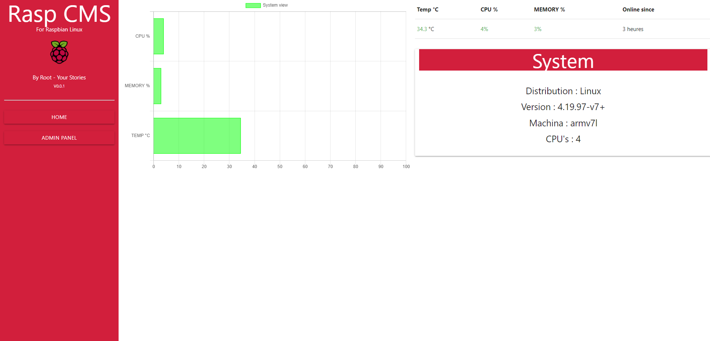

# RASP CMS NodeJS for Raspbian Linux (beta)
## V 0.1.2a
### By Root - Your Stories

## How install
- git clone https://github.com/R0ot16/rasp-cms
- in root directory : npm i
- in stats directory : npm i

## How Run
- go to stats directory
- node index.js

- Now, go on your Rasperry IP or domain