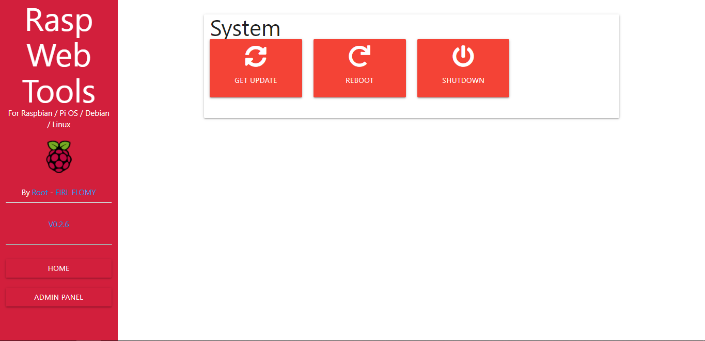

# RASP WEB TOOLS for Raspbian Linux (beta)
## V 0.3.4
### By Root - EIRL FLOMY

## How install

- Go in web directory (/var/www/html)

- Install Git : apt install git
- then type: Git clone https://github.com/R0ot16/rasp-web-tools/
- Run install : "sudo sh install.sh"

* If you obtain an error, please read the returned error.

## Configure 
- Configure client in "./js/config.js"
- Configure server in "./stats/config/index.js"

## How Run
- go to stats directory
- This project use foreverjs. You can run with forever : "forever start index.js" or run with node : "node index.js"
- Now, go on your Rasperry IP or domain